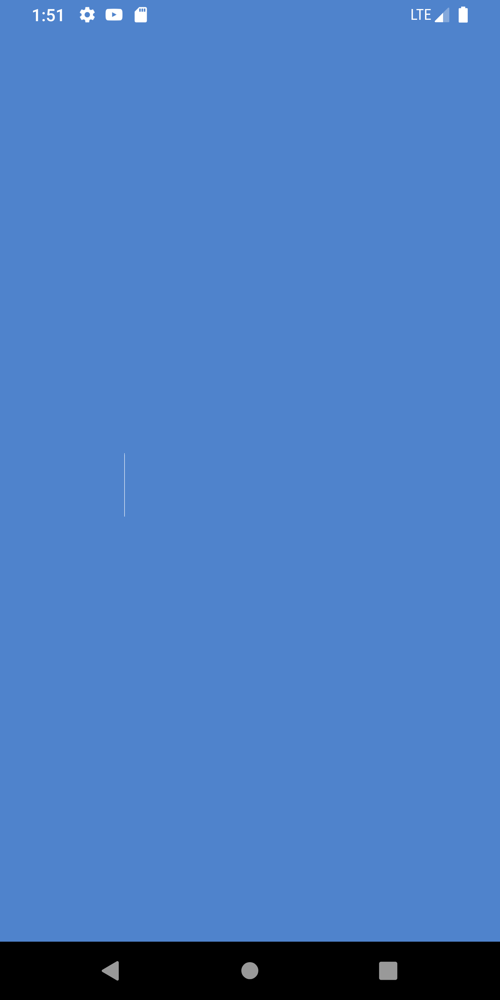

# App - API MARVEL - MVVM

Aplicación Android basada en el API de marvel, para la consulta de comics y series, esta basada en el patron de diseño MVVM 

## ARQUITECTURA MVVM

El patrón modelo–vista–modelo de vista (en inglés, model–view–viewmodel, abreviado MVVM) es un patrón de arquitectura de software. Se caracteriza por tratar de desacoplar lo máximo posible la interfaz de usuario de la lógica de la aplicación.
	

## Herramientas:

* [retrofit](https://square.github.io/retrofit/) - Librería Http, conexión del API con la aplicación.
* [lottie-android](https://github.com/airbnb/lottie-android) - Gestor de animaciones.
* [glide](https://github.com/bumptech/glide) - Gestor de Imágenes.

## Versión
	* Versión 0.0.1-beta
		

## Instalador

## Screenshot

## Autor

* **Santiago Sepulvbeda** - *Desarrollador Android* - [web](https://ssepulveda08.github.io/Santiagoweb/)
